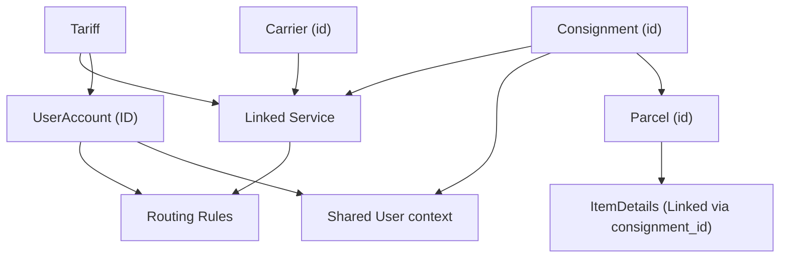

# Complete Database Map & Analysis

## Overview
- **Total Tables**: 266
- **Core Areas**: Accounts, Carriers, Consignments, Labels, Pricing, Geography.

## Relationship Hierarchy (Simplified)

## Core Backend Services & Logic

In addition to the database schema, the following core services have been identified in the codebase:

### 1. Routing Engine (`RoutingService.php`)
- Implements a **4-step routing algorithm**:
  1. **User Specific**: Checks `user_services_routings` for explicit account-level service agreement.
  2. **Customized Rules**: Checks `carrier_service_customize_rules` for weight-based agent overrides.
  3. **Parent Inheritance**: Recursive check for inherited rules from parent accounts (to be implemented).
  4. **System Defaults**: Fallback to `carrier_service_default_rules`.

### 2. Pricing Engine (`PricingEngine.php`)
- Handles complex cost calculations including:
  - **Chargeable Weight**: Max of actual weight and volumetric weight (L*W*H / volumetric_denominator).
  - **Base Rates**: Pulled from `tariffs` and `ratebands`.
  - **Surcharges**: Fuel surcharge (percentage-based), Remote Area charges, and Insurance (2% of value).

### 3. Label Generation Logic (`LabelGeneratorInterface.php`)
- Standardized interface for carrier integrations:
  - `generateLabel()`: Triggers API calls to carriers (DHL, UPS, etc.) and returns the PDF path.
  - `getDropOffLocations()`: For services like DPD or Hermes drop-off.
  - `getTrackingStatus()`: Real-time tracking event polling.

---

## Module: Accounts & Users

### Table: `grouphaspermissions`
- **Primary Key**: `NONE` **(MANUAL HANDLING REQUIRED)**
- **Relationships**: `group_id` -> `groups`

| Column | Type | Null | Default | Notes |
|---|---|---|---|---|
| `id` | `int(11)` | NO | NULL | **REQUIRED** |
| `group_id` | `int(11)` | NO | NULL | **REQUIRED** |
| `perm_id` | `int(11)` | NO | NULL | **REQUIRED** |

---

### Table: `groups`
- **Primary Key**: `NONE` **(MANUAL HANDLING REQUIRED)**
- **Status/Soft Delete**: `is_active`, `is_deleted`

| Column | Type | Null | Default | Notes |
|---|---|---|---|---|
| `group_id` | `int(11)` | NO | NULL | **REQUIRED** |
| `group_name` | `varchar(150)` | YES | NULL |  |
| `group_slug` | `varchar(255)` | YES | NULL |  |
| `group_desc` | `varchar(255)` | YES | NULL |  |
| `group_type` | `enum('admin','corporate','client')` | YES | NULL |  |
| `is_active` | `tinyint(1)` | YES | 0 |  |
| `added_by` | `int(11)` | YES | NULL |  |
| `added_date` | `datetime` | YES | NULL |  |
| `is_deleted` | `tinyint(1)` | YES | 0 |  |

---

### Table: `permissions`
- **Primary Key**: `NONE` **(MANUAL HANDLING REQUIRED)**
- **Status/Soft Delete**: `is_active`, `is_deleted`

| Column | Type | Null | Default | Notes |
|---|---|---|---|---|
| `id` | `int(11)` | NO | NULL | **REQUIRED** |
| `lang_key` | `varchar(100)` | YES | NULL |  |
| `parent_id` | `int(11)` | YES | NULL |  |
| `file_name` | `varchar(150)` | YES | NULL |  |
| `description` | `varchar(250)` | YES | NULL |  |
| `added_by` | `int(11)` | YES | NULL |  |
| `added_date` | `datetime` | YES | NULL |  |
| `query_string` | `varchar(100)` | YES | NULL |  |
| `icon` | `varchar(50)` | YES | NULL |  |
| `sort_order` | `int(11)` | YES | NULL |  |
| `is_menu_item` | `tinyint(1)` | NO | 1 | **REQUIRED** |
| `is_active` | `tinyint(1)` | NO | 0 | **REQUIRED** |
| `is_deleted` | `tinyint(1)` | NO | 0 | **REQUIRED** |

---

### Table: `user_accounts`
- **Primary Key**: `NONE` **(MANUAL HANDLING REQUIRED)**
- **Status/Soft Delete**: `active_flag`
- **Relationships**: `warehouse_id` -> `warehouses`, `invoice_bank_details_id` -> `invoice_bank_details`, `theme_id` -> `themes`, `invoice_template_id` -> `invoice_templates`

| Column | Type | Null | Default | Notes |
|---|---|---|---|---|
| `id` | `int(10) unsigned` | NO | NULL | **REQUIRED** |
| `user_account` | `varchar(30)` | YES | NULL |  |
| `active_flag` | `bit(1)` | NO | b'0' | **REQUIRED** |
| `company` | `varchar(100)` | YES | NULL |  |
| `full_name` | `varchar(100)` | YES | NULL |  |
| `return_address` | `varchar(255)` | YES | NULL |  |
| `sms_dpd` | `bit(1)` | YES | b'0' |  |
| `user_service_type` | `enum('CHOICE','ROUTING','BOTH')` | YES | NULL |  |
| `parentid` | `int(11)` | YES | NULL |  |
| `phone` | `varchar(20)` | YES | NULL |  |
| `logo` | `varchar(255)` | YES | NULL |  |
| `instant_label` | `bit(1)` | YES | b'1' |  |
| `country` | `varchar(3)` | YES | NULL |  |
| `country_id` | `int(11)` | YES | NULL |  |
| `tracking_api_access` | `bit(1)` | YES | b'0' |  |
| `import_data_csv` | `bit(1)` | YES | b'0' |  |
| `proforma` | `bit(1)` | YES | b'0' |  |
| `add_tracking` | `bit(1)` | YES | b'0' |  |
| `collection` | `bit(1)` | YES | b'0' |  |
| `default_description` | `varchar(255)` | YES | NULL |  |
| `default_notes` | `varchar(255)` | YES | NULL |  |
| `default_weight` | `decimal(5,2)` | YES | NULL |  |
| `payment_term` | `text` | YES | NULL |  |
| `query_term` | `text` | YES | NULL |  |
| `vat_number` | `varchar(40)` | YES | NULL |  |
| `billing_currency` | `varchar(3)` | YES | GBP |  |
| `vat_chargable` | `bit(1)` | YES | b'0' |  |
| `vat_value` | `decimal(10,2)` | YES | NULL |  |
| `allow_remote_area` | `bit(1)` | YES | b'0' |  |
| `telephone` | `varchar(20)` | YES | NULL |  |
| `billing_address` | `varchar(255)` | YES | NULL |  |
| `date_dispatch` | `bit(1)` | YES | b'0' |  |
| `is_product` | `varchar(2)` | YES | 0 |  |
| `profile_image` | `varchar(255)` | YES | NULL |  |
| `send_courier_data` | `bit(1)` | YES | b'0' |  |
| `archive_server` | `bit(1)` | YES | b'0' |  |
| `credit_check` | `bit(1)` | YES | b'0' |  |
| `tariff_agreed` | `bit(1)` | YES | b'0' |  |
| `sales_person` | `varchar(45)` | YES | NULL |  |
| `scan_document` | `text` | YES | NULL |  |
| `data_entry` | `bit(1)` | YES | b'0' |  |
| `bank_account_title` | `varchar(45)` | YES | NULL |  |
| `bank_sortcode` | `varchar(10)` | YES | NULL |  |
| `bank_account_number` | `varchar(20)` | YES | NULL |  |
| `bank_branch_address` | `varchar(255)` | YES | NULL |  |
| `trade_name_i` | `varchar(50)` | YES | NULL |  |
| `trade_address_i` | `varchar(255)` | YES | NULL |  |
| `trade_email_i` | `varchar(255)` | YES | NULL |  |
| `trade_phone_i` | `varchar(50)` | YES | NULL |  |
| `trade_name_ii` | `varchar(50)` | YES | NULL |  |
| `trade_address_ii` | `varchar(255)` | YES | NULL |  |
| `trade_email_ii` | `varchar(255)` | YES | NULL |  |
| `trade_phone_ii` | `varchar(50)` | YES | NULL |  |
| `reg_number` | `varchar(20)` | YES | NULL |  |
| `reg_address` | `varchar(255)` | YES | NULL |  |
| `reg_postcode` | `varchar(10)` | YES | NULL |  |
| `reg_country` | `varchar(5)` | YES | NULL |  |
| `sale_agent` | `varchar(10)` | YES | NULL |  |
| `sale_date` | `datetime` | YES | NULL |  |
| `fuel_charges` | `decimal(10,2)` | YES | 0.00 |  |
| `warehouse_id` | `int(11)` | YES | NULL |  |
| `user_signature` | `text` | YES | NULL |  |
| `is_fuelcharges_include` | `bit(1)` | YES | b'0' |  |
| `is_prepaid` | `bit(1)` | YES | b'0' |  |
| `return_label` | `bit(1)` | YES | b'0' |  |
| `finalmile_over_label` | `bit(1)` | YES | b'0' |  |
| `request_manifest_collection` | `bit(1)` | YES | b'0' |  |
| `create_pre_alert` | `bit(1)` | YES | b'0' |  |
| `is_employee` | `bit(1)` | NO | b'0' | **REQUIRED** |
| `invoice_bank_details_id` | `int(11)` | YES | 0 |  |
| `check_list_account_form` | `bit(1)` | YES | b'0' |  |
| `check_list_credit_check` | `bit(1)` | YES | b'0' |  |
| `check_list_t_cs` | `bit(1)` | YES | b'0' |  |
| `check_list_tariff_agreed` | `bit(1)` | YES | b'0' |  |
| `check_list_sales_pot` | `bit(1)` | YES | b'0' |  |
| `sales_pot_time_period` | `int(5)` | YES | 0 |  |
| `sales_pot_percentage` | `decimal(5,2)` | YES | 0.00 |  |
| `last_login_date` | `timestamp` | YES | NULL |  |
| `invalid_login_count` | `int(11)` | YES | NULL |  |
| `token` | `varchar(255)` | YES | NULL |  |
| `token_updated` | `timestamp` | YES | NULL |  |
| `lock_time` | `timestamp` | YES | NULL |  |
| `opearation_manifest` | `bit(1)` | YES | b'0' |  |
| `own_tariff` | `bit(1)` | YES | b'0' |  |
| `user_warehouse` | `enum('NON','BIRMINGHAM','HAYES')` | YES | NON |  |
| `api_key` | `varchar(100)` | YES | NULL |  |
| `api_secert` | `varchar(100)` | YES | NULL |  |
| `api_date` | `datetime` | YES | NULL |  |
| `bagging` | `bit(1)` | YES | b'0' |  |
| `retail_customer` | `bit(1)` | YES | b'0' |  |
| `show_price` | `bit(1)` | YES | b'0' |  |
| `sales_rate` | `decimal(10,2)` | YES | NULL |  |
| `collection_add_line_1` | `varchar(50)` | YES | NULL |  |
| `collection_add_line_2` | `varchar(50)` | YES | NULL |  |
| `collection_add_line_3` | `varchar(50)` | YES | NULL |  |
| `collection_city` | `varchar(45)` | YES | NULL |  |
| `collection_postcode` | `varchar(45)` | YES | NULL |  |
| `collection_country` | `varchar(45)` | YES | NULL |  |
| `theme_id` | `int(5)` | YES | NULL |  |
| `user_code` | `int(11)` | YES | NULL |  |
| `website_link` | `varchar(200)` | YES | NULL |  |
| `allow_return_email` | `bit(1)` | YES | b'0' |  |
| `default_lang` | `varchar(10)` | YES | en-GB |  |
| `credit_limit` | `decimal(10,2)` | YES | 0.00 |  |
| `invoice_period` | `enum('daily','weekly','bi-monthly','monthly')` | YES | daily |  |
| `label_price` | `decimal(10,2)` | YES | 0.00 |  |
| `discount` | `decimal(10,2)` | YES | 0.00 |  |
| `account_code` | `varchar(4)` | YES | NULL |  |
| `paypal_email` | `varchar(70)` | YES | NULL |  |
| `paypal_currency` | `varchar(20)` | YES | NULL |  |
| `email` | `varchar(500)` | YES | NULL |  |
| `paypal_client_secret` | `varchar(255)` | YES | NULL |  |
| `alternative_email` | `varchar(500)` | YES | NULL |  |
| `billing_email` | `varchar(500)` | YES | NULL |  |
| `date_created` | `timestamp` | YES | current_timestamp() |  |
| `allow_oversize` | `tinyint(4)` | NO | 0 | **REQUIRED** |
| `allow_overweight` | `tinyint(4)` | NO | 0 | **REQUIRED** |
| `paypal_client_id` | `varchar(255)` | YES | NULL |  |
| `invoice_template_id` | `bigint(20) unsigned` | YES | NULL |  |
| `send_tracking_data` | `bit(1)` | YES | NULL |  |

---

### Table: `user_departments`
- **Primary Key**: `NONE` **(MANUAL HANDLING REQUIRED)**
- **Relationships**: `user_id` -> `users`, `department_id` -> `departments`

| Column | Type | Null | Default | Notes |
|---|---|---|---|---|
| `id` | `bigint(20)` | NO | NULL | **REQUIRED** |
| `user_id` | `bigint(20)` | NO | NULL | **REQUIRED** |
| `department_id` | `int(11)` | NO | NULL | **REQUIRED** |

---

### Table: `users`
- **Primary Key**: `id` (Auto-Increment)
- **Status/Soft Delete**: `active_flag`, `is_deleted`
- **Relationships**: `warehouse_id` -> `warehouses`, `user_account_id` -> `user_accounts`

| Column | Type | Null | Default | Notes |
|---|---|---|---|---|
| `id` | `bigint(20) unsigned` | NO | NULL | PK, **REQUIRED**, AI |
| `name` | `varchar(255)` | NO | NULL | **REQUIRED** |
| `email` | `varchar(255)` | NO | NULL | **REQUIRED** |
| `email_verified_at` | `timestamp` | YES | NULL |  |
| `password` | `varchar(255)` | NO | NULL | **REQUIRED** |
| `user_type` | `enum('corporate','client','admin','driver')` | NO | client | **REQUIRED** |
| `user_name` | `varchar(30)` | YES | NULL |  |
| `active_flag` | `tinyint(1)` | NO | 0 | **REQUIRED** |
| `first_name` | `varchar(100)` | YES | NULL |  |
| `last_name` | `varchar(255)` | YES | NULL |  |
| `address` | `varchar(255)` | YES | NULL |  |
| `phone` | `varchar(20)` | YES | NULL |  |
| `country_id` | `int(11)` | YES | NULL |  |
| `api_key` | `varchar(100)` | YES | NULL |  |
| `api_secret` | `varchar(100)` | YES | NULL |  |
| `api_date` | `datetime` | YES | NULL |  |
| `profile_image` | `varchar(255)` | YES | NULL |  |
| `is_employee` | `tinyint(1)` | NO | 0 | **REQUIRED** |
| `warehouse_id` | `int(11)` | YES | NULL |  |
| `dashboard` | `enum('corporate','operation','customer_service','account','driver')` | NO | corporate | **REQUIRED** |
| `invalid_login_count` | `int(11)` | YES | NULL |  |
| `user_account_id` | `int(11)` | YES | NULL |  |
| `last_login_date` | `datetime` | YES | NULL |  |
| `added_by` | `int(11)` | YES | NULL |  |
| `added_date` | `datetime` | YES | NULL |  |
| `updated_by` | `int(11)` | YES | NULL |  |
| `updated_date` | `datetime` | YES | NULL |  |
| `is_deleted` | `tinyint(1)` | NO | 0 | **REQUIRED** |
| `archive_server` | `tinyint(1)` | NO | 0 | **REQUIRED** |
| `carrier_setup_agreement` | `tinyint(1)` | NO | 0 | **REQUIRED** |
| `receive_email` | `enum('y','n')` | NO | n | **REQUIRED** |
| `tc_agreed_date` | `date` | YES | NULL |  |
| `is_tc_agreed` | `enum('y','n','i')` | NO | n | **REQUIRED** |
| `address_2` | `varchar(50)` | YES | NULL |  |
| `address_3` | `varchar(50)` | YES | NULL |  |
| `city` | `varchar(50)` | YES | NULL |  |
| `postcode` | `varchar(15)` | YES | NULL |  |
| `state` | `varchar(50)` | YES | NULL |  |
| `commission_break_event_amount` | `varchar(50)` | NO |  | **REQUIRED** |
| `is_sale_pot_eligible` | `tinyint(1)` | NO | 0 | **REQUIRED** |
| `remember_token` | `varchar(100)` | YES | NULL |  |
| `created_at` | `timestamp` | YES | NULL |  |
| `updated_at` | `timestamp` | YES | NULL |  |

---

## Module: Carriers & Services

### Table: `carrier_service_customize_rules`
- **Primary Key**: `NONE` **(MANUAL HANDLING REQUIRED)**
- **Status/Soft Delete**: `status`
- **Relationships**: `serviceid` -> `services`, `agentid` -> `agents`, `user_account_id` -> `user_accounts`

| Column | Type | Null | Default | Notes |
|---|---|---|---|---|
| `id` | `int(11)` | NO | NULL | **REQUIRED** |
| `serviceid` | `int(11)` | YES | NULL |  |
| `agentid` | `int(11)` | YES | NULL |  |
| `user_account_id` | `int(11)` | YES | NULL |  |
| `from_weight` | `decimal(10,3)` | YES | NULL |  |
| `to_weight` | `decimal(10,3)` | YES | NULL |  |
| `status` | `bit(1)` | YES | b'1' |  |

---

### Table: `carrier_service_default_rules`
- **Primary Key**: `NONE` **(MANUAL HANDLING REQUIRED)**
- **Relationships**: `serviceid` -> `services`, `agentid` -> `agents`

| Column | Type | Null | Default | Notes |
|---|---|---|---|---|
| `id` | `int(11)` | NO | NULL | **REQUIRED** |
| `serviceid` | `int(11)` | YES | NULL |  |
| `agentid` | `int(11)` | YES | NULL |  |
| `from_weight` | `decimal(10,3)` | YES | NULL |  |
| `to_weight` | `decimal(10,3)` | YES | NULL |  |
| `is_default` | `bit(1)` | YES | NULL |  |
| `agent_type` | `enum('outbound','dispatch')` | NO | outbound | **REQUIRED** |

---

### Table: `carriers`
- **Primary Key**: `NONE` **(MANUAL HANDLING REQUIRED)**
- **Status/Soft Delete**: `status`

| Column | Type | Null | Default | Notes |
|---|---|---|---|---|
| `id` | `int(11)` | NO | NULL | **REQUIRED** |
| `carrier` | `varchar(45)` | YES | NULL |  |
| `logo` | `varchar(45)` | YES | NULL |  |
| `cut_off_time` | `varchar(45)` | YES | NULL |  |
| `carrier_display_name` | `varchar(45)` | YES | NULL |  |
| `status` | `int(1)` | YES | NULL |  |
| `country_id` | `int(11)` | YES | NULL |  |
| `carrier_id` | `int(11)` | YES | NULL |  |
| `currency_code` | `varchar(3)` | YES | GBP |  |
| `remotearea_check` | `enum('c','s')` | NO | c | **REQUIRED** |
| `zone_base` | `bit(1)` | YES | b'0' |  |
| `zone_type` | `enum('country','postcode')` | YES | country |  |
| `on_contract` | `bit(1)` | YES | b'0' |  |
| `is_gazetteer` | `tinyint(1)` | NO | 0 | **REQUIRED** |
| `is_reconcile` | `int(10)` | NO | 0 | **REQUIRED** |

---

### Table: `service_agent_mappings`
- **Primary Key**: `NONE` **(MANUAL HANDLING REQUIRED)**
- **Relationships**: `serviceid` -> `services`, `agentid` -> `agents`

| Column | Type | Null | Default | Notes |
|---|---|---|---|---|
| `id` | `int(11)` | NO | NULL | **REQUIRED** |
| `serviceid` | `int(11)` | YES | NULL |  |
| `agentid` | `int(11)` | YES | NULL |  |
| `linehaul_agent` | `int(1)` | YES | 0 |  |
| `account_number` | `varchar(45)` | YES | NULL |  |
| `api_url` | `varchar(200)` | YES | NULL |  |
| `api_username` | `varchar(45)` | YES | NULL |  |
| `api_password` | `varchar(45)` | YES | NULL |  |
| `ftp_host` | `varchar(45)` | YES | NULL |  |
| `ftp_username` | `varchar(45)` | YES | NULL |  |
| `ftp_password` | `varchar(45)` | YES | NULL |  |
| `integration_type` | `varchar(5)` | YES | NULL |  |
| `class_file_name` | `varchar(45)` | YES | NULL |  |
| `insurance_charges` | `decimal(8,2)` | YES | 0.00 |  |
| `insurance_cover` | `decimal(8,2)` | YES | 0.00 |  |
| `reroute_charges` | `decimal(8,2)` | YES | 0.00 |  |
| `oversize_charges` | `decimal(8,2)` | YES | 0.00 |  |
| `address_change_charges` | `decimal(8,2)` | YES | 0.00 |  |
| `other_surcharges` | `decimal(8,2)` | YES | 0.00 |  |
| `return_charges` | `decimal(8,2)` | YES | 0.00 |  |
| `relabel_charges` | `decimal(8,2)` | YES | 0.00 |  |
| `wrong_address_charges` | `decimal(8,2)` | YES | 0.00 |  |
| `from_weight` | `decimal(8,2)` | YES | 0.00 |  |
| `to_weight` | `decimal(8,2)` | YES | 0.00 |  |
| `email` | `text` | YES | NULL |  |

---

### Table: `services`
- **Primary Key**: `NONE` **(MANUAL HANDLING REQUIRED)**
- **Status/Soft Delete**: `active`
- **Relationships**: `carrier_id` -> `carriers`

| Column | Type | Null | Default | Notes |
|---|---|---|---|---|
| `id` | `int(10) unsigned` | NO | NULL | **REQUIRED** |
| `name` | `varchar(45)` | NO | NULL | **REQUIRED** |
| `code` | `varchar(20)` | NO | NULL | **REQUIRED** |
| `carrier_id` | `int(11)` | NO | NULL | **REQUIRED** |
| `account_number` | `varchar(20)` | YES | NULL |  |
| `type` | `varchar(5)` | YES | NULL |  |
| `from_weight` | `decimal(10,3)` | YES | NULL |  |
| `to_weight` | `decimal(10,3)` | YES | NULL |  |
| `wieght_type` | `int(11)` | YES | 1 |  |
| `supplier` | `varchar(100)` | YES | NULL |  |
| `service_type` | `enum('D','C','B','DO')` | NO | D | **REQUIRED** |
| `drop_off_service_id` | `bigint(20)` | YES | NULL |  |
| `description` | `text` | YES | NULL |  |
| `fuel_surcharge_cost` | `decimal(9,2)` | YES | NULL |  |
| `fuel_surcharge` | `decimal(9,2)` | NO | NULL | **REQUIRED** |
| `fuel_surcharge_type` | `char(1)` | NO | NULL | **REQUIRED** |
| `max_length` | `decimal(9,2)` | NO | NULL | **REQUIRED** |
| `max_width` | `decimal(9,2)` | NO | NULL | **REQUIRED** |
| `max_height` | `decimal(9,2)` | NO | NULL | **REQUIRED** |
| `max_volumetric_weight` | `decimal(9,2)` | YES | NULL |  |
| `volumetric_denominator` | `int(11)` | YES | 5000 |  |
| `send_data_courier` | `tinyint(4)` | YES | 0 |  |
| `is_document` | `tinyint(1)` | YES | 0 |  |
| `friday_only_flag` | `tinyint(1)` | YES | NULL |  |
| `saturday_only_flag` | `tinyint(1)` | YES | 0 |  |
| `sunday_only_flag` | `tinyint(1)` | YES | 0 |  |
| `product_owner` | `int(11)` | YES | NULL |  |
| `active` | `tinyint(1)` | YES | 1 |  |
| `deletedq` | `tinyint(1)` | YES | 0 |  |
| `added_on` | `datetime` | YES | NULL |  |
| `added_by` | `varchar(100)` | YES | NULL |  |
| `changed_on` | `datetime` | YES | NULL |  |
| `changed_by` | `varchar(100)` | YES | NULL |  |
| `uploaded_currency` | `varchar(3)` | YES | NULL |  |
| `uploaded_currency_value` | `decimal(10,2)` | YES | NULL |  |
| `registration_fee` | `decimal(10,2)` | YES | 0.00 |  |
| `weight_after` | `decimal(10,2)` | YES | 0.00 |  |
| `aditional_charge` | `decimal(10,2)` | YES | 0.00 |  |
| `origin_country` | `int(11)` | YES | 255 |  |
| `is_untrack` | `bit(1)` | YES | b'0' |  |
| `account_owner` | `int(11)` | YES | NULL |  |
| `remotearea` | `enum('ON_WEIGHT','ON_PIECE')` | YES | ON_PIECE |  |
| `carrier_address_limit` | `int(5)` | YES | 30 |  |
| `label_class_name` | `varchar(100)` | YES | NULL |  |
| `transit_time` | `int(3)` | YES | NULL |  |
| `required_email` | `tinyint(1)` | YES | 0 |  |
| `required_telephone` | `tinyint(1)` | YES | 0 |  |
| `shipment_type` | `enum('LETTER','PARCEL')` | YES | PARCEL |  |
| `pre_sort` | `enum('YES','NO')` | YES | NO |  |
| `proforma_invoice` | `tinyint(1)` | YES | 0 |  |
| `agent_dispatch` | `enum('Y','N')` | YES | N |  |
| `brief_manifest` | `enum('Y','N')` | YES | N |  |
| `delivery_mode` | `tinyint(1)` | YES | NULL |  |
| `insurance_available` | `tinyint(1)` | YES | 0 |  |
| `vol_wgt_formula` | `varchar(50)` | YES | NULL |  |
| `is_remotearea` | `enum('Y','N')` | YES | N |  |
| `is_customized` | `bit(1)` | YES | b'0' |  |
| `pre_advise` | `enum('Y','N')` | NO | N | **REQUIRED** |
| `pre_alert` | `enum('Y','N')` | NO | N | **REQUIRED** |
| `pre_alert_email` | `text` | YES | NULL |  |
| `cut_off_time` | `varchar(5)` | YES | NULL |  |
| `label_charges` | `decimal(10,2)` | YES | 0.00 |  |
| `allow_oversize` | `tinyint(4)` | NO | 0 | **REQUIRED** |
| `allow_overweight` | `tinyint(4)` | NO | 0 | **REQUIRED** |
| `maximum_allowed_dimension` | `int(4)` | NO | 0 | **REQUIRED** |
| `maximum_dim_formula` | `varchar(100)` | YES | NULL |  |
| `validation_type` | `enum('mail','courier')` | NO | mail | **REQUIRED** |
| `zone_type` | `enum('country','postcode')` | YES | country |  |
| `tariff_type` | `enum('multi','single')` | YES | single |  |
| `girth` | `decimal(10,2)` | YES | NULL |  |
| `girth_formula` | `varchar(255)` | YES | NULL |  |
| `mail_type` | `enum('letter','boxable','non-boxable')` | YES | NULL |  |
| `mail_option` | `enum('commercial','freight_to_post')` | YES | NULL |  |
| `is_reschedulable` | `int(1)` | NO | 0 | **REQUIRED** |
| `carrier_service_code` | `varchar(50)` | YES | NULL |  |
| `is_eori_required` | `int(2)` | NO | 0 | **REQUIRED** |
| `delivery_type` | `enum('all','economy','priority','')` | NO | all | **REQUIRED** |
| `is_commercials` | `enum('required','not required')` | NO | not required | **REQUIRED** |
| `is_cn` | `enum('required','not required')` | NO | not required | **REQUIRED** |

---

### Table: `user_services_routings`
- **Primary Key**: `NONE` **(MANUAL HANDLING REQUIRED)**
- **Status/Soft Delete**: `status`
- **Relationships**: `user_account_id` -> `user_accounts`, `service_id` -> `services`

| Column | Type | Null | Default | Notes |
|---|---|---|---|---|
| `id` | `int(10) unsigned` | NO | NULL | **REQUIRED** |
| `user_account_id` | `int(11)` | NO | NULL | **REQUIRED** |
| `country_id` | `int(11)` | NO | NULL | **REQUIRED** |
| `from_weight` | `decimal(10,2)` | YES | NULL |  |
| `to_weight` | `decimal(10,2)` | YES | NULL |  |
| `status` | `bit(1)` | NO | b'0' | **REQUIRED** |
| `service_id` | `int(11)` | YES | NULL |  |
| `is_remotearea` | `bit(1)` | NO | b'0' | **REQUIRED** |
| `is_over_label` | `bit(1)` | YES | b'0' |  |
| `added_by` | `int(11)` | NO | NULL | **REQUIRED** |
| `is_agreed` | `bit(1)` | YES | b'0' |  |
| `label_charges` | `decimal(10,2)` | YES | 0.00 |  |
| `is_dead_weight` | `bit(1)` | YES | b'0' |  |
| `is_over_size` | `int(2)` | NO | 0 | **REQUIRED** |

---

## Module: Consignments & Parcels

### Table: `consignment_bagging_mappings`
- **Primary Key**: `NONE` **(MANUAL HANDLING REQUIRED)**
- **Relationships**: `consignmentid` -> `consignments`

| Column | Type | Null | Default | Notes |
|---|---|---|---|---|
| `consignmentid` | `int(11)` | YES | NULL |  |
| `bagid` | `int(11)` | YES | NULL |  |

---

### Table: `consignment_relabels`
- **Primary Key**: `NONE` **(MANUAL HANDLING REQUIRED)**
- **Relationships**: `consignment_id` -> `consignments`, `userid` -> `users`

| Column | Type | Null | Default | Notes |
|---|---|---|---|---|
| `id` | `int(11)` | NO | NULL | **REQUIRED** |
| `consignment_id` | `int(11)` | YES | NULL |  |
| `old_tracking_no` | `varchar(45)` | YES | NULL |  |
| `new_tracking_no` | `varchar(45)` | YES | NULL |  |
| `date_created` | `datetime` | YES | NULL |  |
| `userid` | `int(11)` | YES | NULL |  |
| `old_consignment_data` | `text` | YES | NULL |  |
| `old_parcel_tracking_no` | `text` | YES | NULL |  |
| `old_new_tracking_mapping` | `text` | YES | NULL |  |

---

### Table: `consignment_status_logs`
- **Primary Key**: `NONE` **(MANUAL HANDLING REQUIRED)**
- **Relationships**: `parcel_id` -> `parcels`

| Column | Type | Null | Default | Notes |
|---|---|---|---|---|
| `id` | `bigint(20)` | NO | NULL | **REQUIRED** |
| `parcel_id` | `bigint(20)` | NO | NULL | **REQUIRED** |
| `old_status` | `varchar(100)` | NO | NULL | **REQUIRED** |
| `new_status` | `varchar(100)` | NO | NULL | **REQUIRED** |
| `message` | `text` | YES | NULL |  |
| `added_by` | `bigint(20)` | YES | NULL |  |
| `date_added` | `timestamp` | NO | current_timestamp() | **REQUIRED** |

---

### Table: `consignments`
- **Primary Key**: `NONE` **(MANUAL HANDLING REQUIRED)**
- **Relationships**: `agent_id` -> `agents`, `user_id` -> `users`, `service_id` -> `services`, `warehouse_id` -> `warehouses`

| Column | Type | Null | Default | Notes |
|---|---|---|---|---|
| `id` | `int(11) unsigned` | NO | NULL | **REQUIRED** |
| `agent_id` | `int(11)` | YES | 51 |  |
| `user_id` | `int(11)` | YES | NULL |  |
| `service_id` | `int(11)` | YES | NULL |  |
| `customized_service_id` | `int(11)` | YES | 0 |  |
| `warehouse_user_id` | `int(11)` | YES | NULL |  |
| `warehouse_id` | `int(11)` | YES | NULL |  |
| `sales_pot_id` | `bigint(20)` | YES | NULL |  |
| `invoice_id` | `int(11)` | YES | NULL |  |
| `credit_id` | `int(11)` | YES | NULL |  |
| `is_invoiced` | `int(1)` | YES | 0 |  |
| `invoice_type` | `enum('INV','MNI')` | YES | NULL |  |
| `shipment_status` | `int(4)` | YES | 0 |  |
| `shipment_type` | `enum('C','D','P','DO')` | YES | D |  |
| `awb` | `varchar(30)` | YES | NULL |  |
| `consignment_status` | `varchar(20)` | YES | NULL |  |
| `return_awb` | `varchar(30)` | YES | NULL |  |
| `hawb` | `varchar(40)` | NO | NULL | **REQUIRED** |
| `mawb` | `varchar(40)` | YES | NULL |  |
| `service_name` | `varchar(50)` | YES | NULL |  |
| `reference` | `varchar(20)` | YES | NULL |  |
| `date_created` | `timestamp` | YES | current_timestamp() |  |
| `date_label_created` | `int(11)` | YES | NULL |  |
| `date_booked` | `int(11)` | YES | NULL |  |
| `date_delivered` | `int(11)` | YES | NULL |  |
| `is_customer_manifested` | `int(1)` | YES | 0 |  |
| `booked_file_id` | `varchar(50)` | NO | 0 | **REQUIRED** |
| `company` | `varchar(100)` | YES | NULL |  |
| `contact` | `varchar(100)` | YES | NULL |  |
| `address_line_1` | `varchar(50)` | YES | NULL |  |
| `address_line_2` | `varchar(50)` | YES | NULL |  |
| `address_line_3` | `varchar(50)` | YES | NULL |  |
| `city` | `varchar(50)` | YES | NULL |  |
| `state` | `varchar(45)` | YES | NULL |  |
| `postcode` | `varchar(15)` | YES | NULL |  |
| `country_id` | `int(11)` | YES | NULL |  |
| `telephone` | `varchar(17)` | YES | NULL |  |
| `number_pieces` | `int(3) unsigned` | YES | NULL |  |
| `weight_type` | `varchar(2)` | YES | PP |  |
| `weight` | `decimal(8,3) unsigned` | YES | NULL |  |
| `update_weight` | `decimal(8,3)` | YES | NULL |  |
| `fake_weight` | `decimal(8,3)` | YES | NULL |  |
| `charge_weight` | `decimal(8,3)` | YES | NULL |  |
| `vol_weight` | `decimal(8,3)` | YES | NULL |  |
| `vol_demonimator` | `int(11)` | YES | NULL |  |
| `hv_lv` | `enum('L','H','M')` | YES | NULL |  |
| `description` | `varchar(255)` | YES | NULL |  |
| `notes` | `varchar(255)` | YES | NULL |  |
| `value` | `decimal(10,2) unsigned` | YES | NULL |  |
| `currency` | `varchar(3)` | YES | NULL |  |
| `sender_name` | `varchar(45)` | NO | NULL | **REQUIRED** |
| `username` | `varchar(45)` | YES | NULL |  |
| `sender_checked` | `int(1)` | YES | 0 |  |
| `message` | `varchar(400)` | YES | NULL |  |
| `sorter_image` | `varchar(200)` | YES | NULL |  |
| `label_file` | `varchar(255)` | YES | NULL |  |
| `is_doc` | `int(1)` | YES | 0 |  |
| `email` | `varchar(45)` | YES | NULL |  |
| `itemtype` | `varchar(60)` | YES | NULL |  |
| `routing_code` | `varchar(3)` | YES | NULL |  |
| `routing_code_eur` | `varchar(45)` | YES | NULL |  |
| `other_routing_code` | `varchar(250)` | YES | NULL |  |
| `billing_hold` | `int(1)` | YES | 0 |  |
| `send_courier_data` | `int(1)` | YES | 0 |  |
| `remote_charges` | `int(1)` | YES | 0 |  |
| `reinvoices` | `int(1)` | YES | 0 |  |
| `optimus_sorter` | `int(1)` | YES | 0 |  |
| `full_pallet` | `int(2)` | YES | 0 |  |
| `half_pallet` | `int(2)` | YES | 0 |  |
| `quarter_pallet` | `int(2)` | YES | 0 |  |
| `date_scanned` | `datetime` | YES | NULL |  |
| `consignment_type` | `enum('return','outbound')` | NO | outbound | **REQUIRED** |
| `api_uuid` | `varchar(200)` | YES | NULL |  |
| `sender_company` | `varchar(100)` | YES | NULL |  |
| `sender_email` | `varchar(45)` | YES | NULL |  |
| `sender_telephone` | `varchar(17)` | YES | NULL |  |
| `sender_address_line_1` | `varchar(255)` | YES | NULL |  |
| `sender_address_line_2` | `varchar(255)` | YES | NULL |  |
| `sender_address_line_3` | `varchar(255)` | YES | NULL |  |
| `sender_city` | `varchar(50)` | YES | NULL |  |
| `sender_postcode` | `varchar(15)` | YES | NULL |  |
| `sender_country_id` | `int(11)` | YES | NULL |  |
| `sender_state` | `varchar(45)` | YES | NULL |  |
| `collection_date` | `date` | YES | NULL |  |
| `collection_start_time` | `varchar(5)` | YES | NULL |  |
| `collection_end_time` | `varchar(5)` | YES | NULL |  |
| `collection_confirmation_no` | `varchar(45)` | YES | NULL |  |
| `created_from` | `enum('web','api','csv')` | YES | web |  |
| `is_white_label` | `tinyint(4)` | NO | 0 | **REQUIRED** |
| `is_dead_weight_chargable` | `tinyint(4)` | YES | 0 |  |
| `is_customer_billable` | `int(1)` | NO | 0 | **REQUIRED** |
| `ioss_number` | `varchar(50)` | NO | 0 | **REQUIRED** |
| `eori_number` | `varchar(50)` | NO | 0 | **REQUIRED** |
| `vat_number` | `varchar(50)` | NO | 0 | **REQUIRED** |
| `is_over_size_chargable` | `int(5)` | NO | 0 | **REQUIRED** |
| `is_insured` | `int(1)` | NO | 0 | **REQUIRED** |
| `destination_warehouse_id` | `int(5)` | YES | 0 |  |
| `consignment_seller` | `text` | YES | NULL |  |

---

### Table: `item_details`
- **Primary Key**: `NONE` **(MANUAL HANDLING REQUIRED)**
- **Relationships**: `consignment_id` -> `consignments`, `session_id` -> `sessions`, `user_id` -> `users`

| Column | Type | Null | Default | Notes |
|---|---|---|---|---|
| `id` | `int(11)` | NO | NULL | **REQUIRED** |
| `consignment_id` | `int(11)` | NO | NULL | **REQUIRED** |
| `session_id` | `varchar(50)` | NO | NULL | **REQUIRED** |
| `parcel_count` | `int(5)` | NO | NULL | **REQUIRED** |
| `item_detail` | `text` | NO | NULL | **REQUIRED** |
| `user_id` | `int(11)` | NO | NULL | **REQUIRED** |

---

### Table: `manifests`
- **Primary Key**: `NONE` **(MANUAL HANDLING REQUIRED)**
- **Status/Soft Delete**: `is_deleted`
- **Relationships**: `user_id` -> `users`, `agent_id` -> `agents`, `service_id` -> `services`, `pickup_id` -> `pickups`, `carrier_id` -> `carriers`

| Column | Type | Null | Default | Notes |
|---|---|---|---|---|
| `id` | `int(11)` | NO | NULL | **REQUIRED** |
| `user_id` | `int(11)` | YES | NULL |  |
| `file_name` | `varchar(500)` | YES | NULL |  |
| `label_link` | `varchar(100)` | YES | NULL |  |
| `date_created` | `datetime` | YES | NULL |  |
| `pieces` | `varchar(45)` | YES | NULL |  |
| `agent_id` | `bigint(20)` | YES | NULL |  |
| `weight` | `decimal(10,3)` | YES | NULL |  |
| `service_id` | `int(11)` | YES | NULL |  |
| `handling` | `varchar(200)` | YES | NULL |  |
| `pdf_file` | `varchar(500)` | YES | NULL |  |
| `flight_number` | `varchar(45)` | YES | NULL |  |
| `mawb` | `varchar(45)` | YES | NULL |  |
| `type` | `varchar(45)` | YES | NULL |  |
| `collection_comment` | `text` | YES | NULL |  |
| `collection_date` | `datetime` | YES | NULL |  |
| `collection_date_to` | `datetime` | YES | NULL |  |
| `pickup_date` | `datetime` | YES | NULL |  |
| `delivery_note` | `text` | YES | NULL |  |
| `signature` | `varchar(100)` | YES | NULL |  |
| `pickup_id` | `int(11)` | YES | NULL |  |
| `route_warehouse_id` | `int(11)` | YES | NULL |  |
| `routing_email_date` | `datetime` | YES | NULL |  |
| `date_received` | `datetime` | YES | NULL |  |
| `received_by` | `varchar(45)` | YES | NULL |  |
| `name_of_driver` | `varchar(100)` | YES | NULL |  |
| `licence_number` | `varchar(100)` | YES | NULL |  |
| `account_owner` | `varchar(45)` | YES | NULL |  |
| `number_bag` | `varchar(45)` | YES | NULL |  |
| `product` | `varchar(500)` | YES | NULL |  |
| `carrier_note` | `varchar(5000)` | YES | NULL |  |
| `carrier_pdf` | `varchar(500)` | YES | NULL |  |
| `carrier_id` | `int(11)` | YES | NULL |  |
| `is_deleted` | `enum('Y','N')` | YES | N |  |
| `is_dispatched` | `enum('Y','N')` | NO | N | **REQUIRED** |
| `is_send_email` | `enum('Y','N')` | NO | N | **REQUIRED** |
| `manifest_by` | `enum('operation','client')` | NO | client | **REQUIRED** |

---

### Table: `parcels`
- **Primary Key**: `NONE` **(MANUAL HANDLING REQUIRED)**
- **Relationships**: `consignment_id` -> `consignments`

| Column | Type | Null | Default | Notes |
|---|---|---|---|---|
| `id` | `int(11) unsigned` | NO | NULL | **REQUIRED** |
| `consignment_id` | `int(11) unsigned` | NO | NULL | **REQUIRED** |
| `tracking_number` | `varchar(32)` | YES | NULL |  |
| `do_tracking_number` | `varchar(32)` | YES | NULL |  |
| `length` | `decimal(10,2) unsigned` | NO | 0.00 | **REQUIRED** |
| `width` | `decimal(10,2) unsigned` | NO | 0.00 | **REQUIRED** |
| `height` | `decimal(10,2) unsigned` | NO | 0.00 | **REQUIRED** |
| `weight` | `decimal(4,2)` | NO | NULL | **REQUIRED** |
| `description` | `text` | YES | NULL |  |
| `parcel_message` | `text` | YES | NULL |  |
| `qty` | `varchar(45)` | YES | NULL |  |
| `commoditycode` | `varchar(300)` | YES | NULL |  |
| `hscode` | `varchar(300)` | YES | NULL |  |
| `grossweight` | `decimal(10,2)` | YES | NULL |  |
| `pweight` | `varchar(45)` | YES | NULL |  |
| `itemvalue` | `varchar(300)` | YES | NULL |  |
| `number_item` | `int(2)` | YES | NULL |  |
| `tarrif_no` | `varchar(45)` | YES | NULL |  |
| `update_weight` | `decimal(10,2)` | YES | NULL |  |
| `owe_status_code` | `varchar(200)` | YES | NULL |  |
| `chute_sorted` | `int(4)` | YES | NULL |  |
| `parcel_status_code` | `int(3)` | YES | NULL |  |
| `routing_code` | `varchar(45)` | YES | NULL |  |
| `last_tracking_update` | `datetime` | YES | NULL |  |
| `parcel_item_desc` | `text` | YES | NULL |  |
| `parcel_label` | `varchar(255)` | YES | NULL |  |
| `itemsku` | `varchar(255)` | YES | NULL |  |
| `itemurl` | `varchar(255)` | YES | NULL |  |
| `sort_type` | `varchar(50)` | YES | NULL |  |

---

### Table: `products`
- **Primary Key**: `NONE` **(MANUAL HANDLING REQUIRED)**
- **Status/Soft Delete**: `status`

| Column | Type | Null | Default | Notes |
|---|---|---|---|---|
| `id` | `int(11)` | NO | NULL | **REQUIRED** |
| `country_id` | `int(11)` | YES | NULL |  |
| `product_name` | `varchar(45)` | NO | NULL | **REQUIRED** |
| `insurance` | `decimal(5,2)` | YES | NULL |  |
| `description` | `varchar(255)` | YES | NULL |  |
| `status` | `int(1)` | YES | 1 |  |
| `from_weight` | `decimal(10,3)` | YES | NULL |  |
| `to_weight` | `decimal(10,3)` | YES | NULL |  |
| `logo` | `varchar(45)` | YES | NULL |  |
| `length` | `int(11)` | YES | NULL |  |
| `width` | `int(11)` | YES | NULL |  |
| `height` | `int(11)` | YES | NULL |  |
| `vol_weight` | `decimal(10,3)` | YES | NULL |  |
| `vol_denominator` | `int(1)` | YES | NULL |  |
| `is_untrack` | `int(1)` | YES | NULL |  |
| `remotearea_charges` | `decimal(10,3)` | YES | NULL |  |
| `fuel_charges` | `decimal(10,3)` | YES | NULL |  |
| `added_date` | `timestamp` | YES | current_timestamp() |  |
| `added_by` | `int(11)` | YES | NULL |  |
| `transit_time` | `varchar(45)` | YES | NULL |  |

---

## Module: Label Generation

### Table: `consignment_relabels`
- **Primary Key**: `NONE` **(MANUAL HANDLING REQUIRED)**
- **Relationships**: `consignment_id` -> `consignments`, `userid` -> `users`

| Column | Type | Null | Default | Notes |
|---|---|---|---|---|
| `id` | `int(11)` | NO | NULL | **REQUIRED** |
| `consignment_id` | `int(11)` | YES | NULL |  |
| `old_tracking_no` | `varchar(45)` | YES | NULL |  |
| `new_tracking_no` | `varchar(45)` | YES | NULL |  |
| `date_created` | `datetime` | YES | NULL |  |
| `userid` | `int(11)` | YES | NULL |  |
| `old_consignment_data` | `text` | YES | NULL |  |
| `old_parcel_tracking_no` | `text` | YES | NULL |  |
| `old_new_tracking_mapping` | `text` | YES | NULL |  |

---

### Table: `label_files`
- **Primary Key**: `NONE` **(MANUAL HANDLING REQUIRED)**

| Column | Type | Null | Default | Notes |
|---|---|---|---|---|
| `id` | `int(11) unsigned` | NO | NULL | **REQUIRED** |
| `file_name` | `varchar(100)` | YES | NULL |  |
| `account_number` | `varchar(30)` | YES | NULL |  |
| `hawb_list` | `text` | YES | NULL |  |
| `created_date` | `datetime` | YES | NULL |  |
| `error_list` | `varchar(255)` | YES | NULL |  |

---

## Module: Rates & Pricing

### Table: `consignment_charges_types`
- **Primary Key**: `NONE` **(MANUAL HANDLING REQUIRED)**
- **Status/Soft Delete**: `status`

| Column | Type | Null | Default | Notes |
|---|---|---|---|---|
| `id` | `int(11)` | NO | NULL | **REQUIRED** |
| `title` | `varchar(255)` | NO | NULL | **REQUIRED** |
| `charges_key` | `varchar(255)` | NO | NULL | **REQUIRED** |
| `charge_type` | `enum('both','customer','agent')` | NO | both | **REQUIRED** |
| `apply_per_kg` | `bit(1)` | NO | b'0' | **REQUIRED** |
| `is_extra_charge` | `bit(1)` | NO | b'0' | **REQUIRED** |
| `is_vat` | `bit(1)` | NO | b'0' | **REQUIRED** |
| `has_account_default_value` | `bit(1)` | NO | b'0' | **REQUIRED** |
| `is_replace_charges` | `bit(1)` | YES | b'0' |  |
| `status` | `tinyint(1)` | NO | 1 | **REQUIRED** |
| `is_delete` | `bit(1)` | YES | b'0' |  |
| `added_by` | `int(11)` | NO | NULL | **REQUIRED** |
| `added_date` | `timestamp` | NO | current_timestamp() | **REQUIRED** |
| `updated_by` | `int(11)` | YES | NULL |  |
| `updated_date` | `datetime` | YES | NULL |  |

---

### Table: `ratebands`
- **Primary Key**: `NONE` **(MANUAL HANDLING REQUIRED)**
- **Status/Soft Delete**: `active`

| Column | Type | Null | Default | Notes |
|---|---|---|---|---|
| `id` | `int(11) unsigned` | NO | NULL | **REQUIRED** |
| `courier_service_id` | `int(11) unsigned` | NO | NULL | **REQUIRED** |
| `name` | `varchar(100)` | NO | NULL | **REQUIRED** |
| `orderq` | `int(5)` | NO | 0 | **REQUIRED** |
| `active` | `tinyint(4)` | YES | 1 |  |
| `deletedq` | `char(1)` | YES | N |  |
| `added_on` | `datetime` | YES | NULL |  |
| `added_by` | `varchar(100)` | YES | NULL |  |
| `changed_on` | `datetime` | YES | NULL |  |
| `changed_by` | `varchar(100)` | YES | NULL |  |

---

### Table: `sp_tariff_logs`
- **Primary Key**: `NONE` **(MANUAL HANDLING REQUIRED)**
- **Relationships**: `consignment_id` -> `consignments`

| Column | Type | Null | Default | Notes |
|---|---|---|---|---|
| `id` | `int(11)` | NO | NULL | **REQUIRED** |
| `account_id` | `int(11)` | YES | NULL |  |
| `charges_type` | `varchar(45)` | YES | NULL |  |
| `charges` | `decimal(10,2)` | YES | 0.00 |  |
| `formulla` | `varchar(100)` | YES | NULL |  |
| `date_added` | `timestamp` | YES | current_timestamp() |  |
| `consignment_id` | `int(11)` | YES | 0 |  |

---

### Table: `tariff_additional_charges`
- **Primary Key**: `NONE` **(MANUAL HANDLING REQUIRED)**
- **Relationships**: `tariff_id` -> `tariffs`, `consignment_charges_types_id` -> `consignment_charges_types`

| Column | Type | Null | Default | Notes |
|---|---|---|---|---|
| `id` | `bigint(20) unsigned` | NO | NULL | **REQUIRED** |
| `tariff_id` | `bigint(20) unsigned` | NO | NULL | **REQUIRED** |
| `consignment_charges_types_id` | `bigint(20) unsigned` | NO | NULL | **REQUIRED** |
| `charge` | `decimal(10,2) unsigned` | NO | 0.00 | **REQUIRED** |
| `charge_type` | `enum('fixed','percentage')` | YES | fixed |  |
| `added_by` | `bigint(20)` | YES | NULL |  |
| `added_date` | `datetime` | YES | NULL |  |
| `updated_by` | `bigint(20)` | YES | NULL |  |
| `updated_date` | `datetime` | YES | NULL |  |

---

### Table: `tariffs`
- **Primary Key**: `NONE` **(MANUAL HANDLING REQUIRED)**
- **Status/Soft Delete**: `status`
- **Relationships**: `user_account_id` -> `user_accounts`, `carrier_id` -> `carriers`, `service_id` -> `services`, `tariffs_pricing_rule_id` -> `tariffs_pricing_rules`

| Column | Type | Null | Default | Notes |
|---|---|---|---|---|
| `id` | `int(11)` | NO | NULL | **REQUIRED** |
| `user_account_id` | `int(11)` | NO | NULL | **REQUIRED** |
| `carrier_id` | `int(11)` | NO | NULL | **REQUIRED** |
| `service_id` | `int(11)` | YES | NULL |  |
| `name` | `varchar(45)` | YES | NULL |  |
| `status` | `tinyint(1)` | YES | 0 |  |
| `currency_id` | `int(11)` | YES | 2 |  |
| `tariff_type` | `enum('customer','supplier')` | YES | NULL |  |
| `start_date` | `date` | YES | NULL |  |
| `end_date` | `date` | YES | NULL |  |
| `description` | `text` | YES | NULL |  |
| `tariffs_pricing_rule_id` | `int(11)` | YES | 0 |  |
| `date_added` | `timestamp` | YES | current_timestamp() |  |
| `added_by` | `int(11)` | YES | NULL |  |
| `date_updated` | `datetime` | YES | NULL |  |
| `updated_by` | `int(11)` | YES | NULL |  |

---

## Module: Geography

### Table: `carrier_zones`
- **Primary Key**: `NONE` **(MANUAL HANDLING REQUIRED)**
- **Status/Soft Delete**: `status`, `deleted`
- **Relationships**: `carrier_id` -> `carriers`, `service_id` -> `services`

| Column | Type | Null | Default | Notes |
|---|---|---|---|---|
| `id` | `int(11) unsigned` | NO | NULL | **REQUIRED** |
| `carrier_id` | `int(11)` | NO | NULL | **REQUIRED** |
| `service_id` | `int(11) unsigned` | YES | NULL |  |
| `name` | `varchar(100)` | NO | NULL | **REQUIRED** |
| `sort_order` | `int(5)` | NO | 0 | **REQUIRED** |
| `status` | `tinyint(1)` | NO | 1 | **REQUIRED** |
| `deleted` | `tinyint(1)` | NO | 0 | **REQUIRED** |
| `date_added` | `datetime` | YES | NULL |  |
| `added_by` | `int(11)` | YES | NULL |  |
| `date_updated` | `datetime` | YES | NULL |  |
| `updated_by` | `int(11)` | YES | NULL |  |

---

### Table: `carrier_zones_countries`
- **Primary Key**: `NONE` **(MANUAL HANDLING REQUIRED)**
- **Relationships**: `carrier_zone_id` -> `carrier_zones`

| Column | Type | Null | Default | Notes |
|---|---|---|---|---|
| `id` | `int(11) unsigned` | NO | NULL | **REQUIRED** |
| `country_id` | `int(11) unsigned` | NO | NULL | **REQUIRED** |
| `carrier_zone_id` | `int(11) unsigned` | NO | NULL | **REQUIRED** |

---

### Table: `carrier_zones_postcodes`
- **Primary Key**: `NONE` **(MANUAL HANDLING REQUIRED)**
- **Relationships**: `carrier_zone_id` -> `carrier_zones`

| Column | Type | Null | Default | Notes |
|---|---|---|---|---|
| `id` | `int(11) unsigned` | NO | 0 | **REQUIRED** |
| `carrier_zone_id` | `int(11) unsigned` | NO | NULL | **REQUIRED** |
| `postcode` | `varchar(15)` | NO | NULL | **REQUIRED** |

---

### Table: `countries`
- **Primary Key**: `NONE` **(MANUAL HANDLING REQUIRED)**
- **Status/Soft Delete**: `active`

| Column | Type | Null | Default | Notes |
|---|---|---|---|---|
| `id` | `int(11)` | NO | NULL | **REQUIRED** |
| `iso` | `char(3)` | NO | NULL | **REQUIRED** |
| `name` | `varchar(80)` | YES | NULL |  |
| `region` | `varchar(45)` | YES | NULL |  |
| `postcode_required` | `enum('YES','NO')` | YES | YES |  |
| `type` | `varchar(1)` | YES | NULL |  |
| `region_collection` | `varchar(45)` | YES | NULL |  |
| `numcode` | `int(3) unsigned zerofill` | YES | NULL |  |
| `allow_express` | `char(1)` | YES | NULL |  |
| `allow_classic` | `char(1)` | YES | NULL |  |
| `eu_country` | `char(1)` | YES | NULL |  |
| `shipping_advice` | `varchar(255)` | YES | NULL |  |
| `is_vatable` | `enum('YES','NO')` | YES | NO |  |
| `vat_rate` | `decimal(2,2)` | YES | NULL |  |
| `printable_name` | `varchar(80)` | NO | NULL | **REQUIRED** |
| `iso3` | `char(3)` | YES | NULL |  |
| `export_flag` | `int(11)` | YES | NULL |  |
| `timezone_difference` | `int(11)` | YES | NULL |  |
| `has_postcodeq` | `char(1)` | NO | NULL | **REQUIRED** |
| `has_subzonesq` | `char(1)` | NO | NULL | **REQUIRED** |
| `orderq` | `int(5)` | NO | NULL | **REQUIRED** |
| `active` | `tinyint(2)` | NO | 1 | **REQUIRED** |
| `deletedq` | `char(1)` | NO | N | **REQUIRED** |
| `added_on` | `datetime` | NO | NULL | **REQUIRED** |
| `added_by` | `varchar(100)` | NO | NULL | **REQUIRED** |
| `changed_on` | `datetime` | NO | NULL | **REQUIRED** |
| `changed_by` | `varchar(100)` | NO | NULL | **REQUIRED** |
| `vat_charged_flag` | `int(11)` | YES | NULL |  |
| `customs_flag` | `int(11)` | YES | NULL |  |
| `description` | `text` | YES | NULL |  |
| `country_image` | `varchar(75)` | YES | NULL |  |
| `metakeywords` | `varchar(300)` | YES | NULL |  |
| `metadescription` | `varchar(300)` | YES | NULL |  |
| `pagetitle` | `varchar(100)` | YES | NULL |  |
| `countrybanner` | `varchar(75)` | YES | NULL |  |
| `opcode` | `varchar(5)` | YES | NULL |  |
| `iso_three` | `varchar(3)` | YES | NULL |  |
| `german_name` | `varchar(80)` | YES | NULL |  |
| `manifest_template` | `varchar(80)` | YES | NULL |  |
| `bag_template` | `varchar(80)` | YES | NULL |  |
| `bag_weight_limit` | `int(11)` | YES | NULL |  |
| `bag_low_value` | `int(11)` | YES | NULL |  |
| `currency_id` | `int(11)` | NO | NULL | **REQUIRED** |

---

## Summary of Critical Tables for Implementation

| Area | Primary Tables | Key Foreign Keys |
|---|---|---|
| **Consignment Creation** | `consignments`, `parcels`, `item_details` | `user_id`, `service_id`, `consignment_id` |
| **Service Selection** | `services`, `user_services_routings`, `carriers` | `carrier_id`, `user_account_id` |
| **Label Generation** | `label_files`, `consignments` (label_file col) | `account_number`, `hawb_list` |
| **Pricing** | `tariffs`, `tariff_additional_charges` | `user_account_id`, `service_id` |
